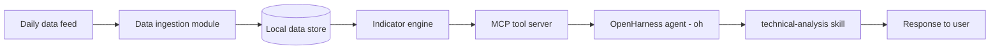

# Master Plan: Vietnamese Stock Technical Analysis Agent

## 0. Purpose of this document

This is an execution plan for a coding agent to build a technical-analysis-capable
investment agent for Vietnamese stocks, running on OpenHarness with a dedicated MCP
tool server and a reasoning skill. It defines the current data constraints, the
system architecture, the repository layout, and a phased implementation plan with
concrete acceptance criteria.

The coding agent executing this plan should treat each phase in section 9 as a
checklist to complete in order, and should not build anything listed in the
deferred roadmap (section 10) until the trigger condition for it is actually met.

Execution rule: any Python environment setup, dependency installation, packaging,
or local virtual environment work must use `uv` rather than ad hoc `pip` commands.
This project is intended to be reproducible from a single `uv`-managed project
configuration, with `pyproject.toml` as the source of truth unless an explicit
compatibility artifact is required.

---

## 1. Current data reality

The data feed is the VietinBank market data API (`GetTradingStatistics`). Per
ticker, per trading day, it returns:

| Field | Description |
|---|---|
| `Symbol` | Stock symbol |
| `Date` | Trading date |
| `PricePreviousClose` | Previous close price |
| `PriceClose` | Close price |
| `TotalTrade` | Number of matched trades |
| `TotalValue` | Total traded value, in VND |
| `TotalVolume` | Total traded volume, in shares |
| `BuyCount` | Number of buy-side trades |
| `SellCount` | Number of sell-side trades |
| `BuyQuantity` | Volume matched on the buy side |
| `SellQuantity` | Volume matched on the sell side |
| `ForeignerBuyQuantity` | Volume bought by foreign investors |
| `ForeignerSellQuantity` | Volume sold by foreign investors |
| `ForeignerBuyValue` | Value bought by foreign investors, in VND |
| `ForeignerSellValue` | Value sold by foreign investors, in VND |
| `CurrentForeignRoom` | Remaining foreign ownership room, in shares, as of this date |

This corrects the earlier version of this plan in two ways. First, it assumed an
`open` field that does not exist in this feed, only close and previous close are
present. Second, it treated trade count, VND value, and foreign room as
unavailable and deferred them, when in fact all three are present in the actual
response. All three are promoted to Tier 0 in this revision.

We do **not** have, and must not assume the existence of: open, high, low,
intraday or tick-level data, fundamentals or financial statement data, news or
sentiment data.

Every module in this plan is built strictly against the schema above. Any feature
that would require open, high, low, or intraday data belongs in the deferred
roadmap (section 10), not in the active build.

---

## 2. Feasibility matrix

| Technique | Computable now | Basis |
|---|---|---|
| SMA / EMA | Yes | PriceClose |
| MACD | Yes | PriceClose |
| RSI | Yes | PriceClose |
| Bollinger Bands | Yes | PriceClose (classic Bollinger uses closing price for both the middle band and the standard deviation, it does not require high/low) |
| OBV | Yes | PriceClose direction, TotalVolume |
| Buy/sell volume imbalance | Yes | BuyQuantity, SellQuantity |
| Buy/sell trade-count imbalance | Yes | BuyCount, SellCount |
| Average trade size by side | Yes | BuyQuantity / BuyCount, SellQuantity / SellCount |
| Average trade value, unusual-value-day flag | Yes | TotalValue, TotalTrade |
| Foreign net volume | Yes | ForeignerBuyQuantity, ForeignerSellQuantity |
| Foreign net value | Yes | ForeignerBuyValue, ForeignerSellValue |
| Foreign participation ratio | Yes | foreign volume vs TotalVolume |
| Foreign room trend | Yes | day-over-day change in CurrentForeignRoom |
| Close-to-close realized volatility | Yes, as an ATR substitute | rolling stdev of daily returns on PriceClose |
| Overnight gap | No | needs open price, not present in this feed |
| Candle body ratio | No | needs open price, not present in this feed |
| ATR (true) | No | needs high/low |
| ADX | No | needs high/low |
| Stochastic Oscillator | No | needs high/low |
| Ichimoku | No | needs high/low |
| True intraday VWAP | No | needs tick data |
| Wick-based support/resistance | No | needs high/low |
| Market breadth / sector rotation | Out of scope for v1 | needs multi-ticker aggregation, not a per-ticker concern |

Anything marked "No" must not be silently approximated and presented as the real
thing. If a user asks for it, the skill must say it is not available with the
current data feed rather than fabricate a value.

---

## 3. Architecture


Components:

- **Data ingestion module**: loads daily records from the feed, validates them,
  upserts into the store.
- **Local data store**: SQLite table matching the schema in section 5.
- **Indicator engine**: pure functions that compute Tier 0 indicators from stored
  data. No I/O inside these functions.
- **MCP tool server**: exposes `get_price_data`, `compute_indicators`, and
  `get_flow_summary` to the agent.
- **OpenHarness agent**: runs `oh` configured with the MCP server above.
- **Skill**: `technical-analysis/SKILL.md`, encodes the reasoning framework in
  section 8.

---

## 4. Repository layout

```
ta-agent/
  data/
    ingest.py
    store.py
    schema.sql
  indicators/
    trend.py
    momentum.py
    volatility.py
    volume_flow.py
    trade_flow.py
    value_flow.py
    foreign_flow.py
    engine.py
  mcp_server/
    server.py
    tool_schemas.py
  skills/
    technical-analysis/
      SKILL.md
  tests/
    test_indicators.py
    test_mcp_server.py
    fixtures/
      sample_daily_data.json
      ground_truth.json
  mcp_config.json
  requirements.txt
  README.md
```

---

## 5. Data schema

```sql
CREATE TABLE daily_prices (
    ticker TEXT NOT NULL,
    date TEXT NOT NULL,
    prev_close REAL NOT NULL,
    close REAL NOT NULL,
    total_trade INTEGER NOT NULL,
    total_value REAL NOT NULL,
    total_volume INTEGER NOT NULL,
    buy_count INTEGER NOT NULL,
    sell_count INTEGER NOT NULL,
    buy_volume INTEGER NOT NULL,
    sell_volume INTEGER NOT NULL,
    foreign_buy_volume INTEGER NOT NULL,
    foreign_sell_volume INTEGER NOT NULL,
    foreign_buy_value REAL NOT NULL,
    foreign_sell_value REAL NOT NULL,
    foreign_room INTEGER NOT NULL,
    PRIMARY KEY (ticker, date)
);
```

Field mapping from the raw API response: `Symbol` to `ticker`, `Date` to `date`,
`PricePreviousClose` to `prev_close`, `PriceClose` to `close`, `TotalTrade` to
`total_trade`, `TotalValue` to `total_value`, `TotalVolume` to `total_volume`,
`BuyCount`/`SellCount` to `buy_count`/`sell_count`, `BuyQuantity`/`SellQuantity`
to `buy_volume`/`sell_volume`, `ForeignerBuyQuantity`/`ForeignerSellQuantity` to
`foreign_buy_volume`/`foreign_sell_volume`,
`ForeignerBuyValue`/`ForeignerSellValue` to
`foreign_buy_value`/`foreign_sell_value`, `CurrentForeignRoom` to
`foreign_room`. All numeric fields arrive from the API as JSON strings, not
numbers, and must be cast explicitly during ingestion.

Derived fields are computed on read, not stored redundantly unless profiling
later shows a real need:

- `net_buy_volume = buy_volume - sell_volume`
- `net_buy_count = buy_count - sell_count`
- `avg_buy_trade_size = buy_volume / buy_count`
- `avg_sell_trade_size = sell_volume / sell_count`
- `avg_trade_value = total_value / total_trade`
- `foreign_net_volume = foreign_buy_volume - foreign_sell_volume`
- `foreign_net_value = foreign_buy_value - foreign_sell_value`
- `foreign_total_volume = foreign_buy_volume + foreign_sell_volume`
- `foreign_room_change = foreign_room(t) - foreign_room(t - 1)`

`total_volume` and `total_trade` are stored as reported by the provider rather
than derived from `buy_volume + sell_volume` or `buy_count + sell_count`, since
the provider is the source of truth here. Ingestion should log a warning, not
fail, if the derived sums do not reconcile exactly with the provider totals,
since matched-trade classification can legitimately leave a small residual.

---

## 6. Indicator engine spec (Tier 0, build now)

**Group A: Trend**
- `sma(n)`: rolling mean of close
- `ema(n)`: exponential moving average of close
- `macd(fast=12, slow=26, signal=9)`: standard MACD on close

**Group B: Momentum**
- `rsi(n=14)`: Wilder RSI on close

**Group C: Volatility (adapted, no high/low)**
- `bollinger(n=20, k=2)`: SMA of close, plus/minus k times rolling stdev of close
- `close_to_close_volatility(n=20)`: rolling stdev of daily log returns of close,
  expressed as a percentage. Used as the ATR substitute for stop-loss sizing.
  Must be labeled as a substitute wherever it is surfaced, not as ATR.

**Group D: Order flow by volume**
- `buy_sell_volume_imbalance`: `(buy_volume - sell_volume) / (buy_volume + sell_volume)`,
  computed daily and as an n-day rolling average
- `obv`: cumulative sum of signed total_volume, sign taken from the direction of
  close versus previous close. Use the provider's `prev_close` field directly
  rather than looking up the prior row, and cross-check that the two agree.

**Group E: Order flow by trade count**
- `buy_sell_count_imbalance`: `(buy_count - sell_count) / (buy_count + sell_count)`
- `avg_trade_size_by_side`: `buy_volume / buy_count` versus
  `sell_volume / sell_count`, each compared to its own n-day rolling average.
  This distinguishes a few large orders from many small orders on each side,
  which volume imbalance alone cannot tell apart.

**Group F: Value flow**
- `avg_trade_value`: `total_value / total_trade`, compared to its n-day rolling
  average, flags an unusually large or small average ticket size for the day
- `value_spike`: today's `total_value` versus its n-day rolling average, a
  value-weighted alternative to a plain volume spike, more informative on days
  with an unusual price move

**Group G: Foreign flow**
- `foreign_net_volume`: daily value and cumulative running sum
- `foreign_net_value`: daily value and cumulative running sum, in VND, generally
  more informative than the volume figure since it is price-weighted
- `foreign_participation_ratio`: `foreign_total_volume / total_volume`
- `foreign_room_trend`: rolling sum of `foreign_room_change` over n days. A
  sustained negative trend indicates foreign accumulation, a sustained positive
  trend indicates foreign divestment. See the caveat in section 11 about
  non-trading causes of room changes.

Every function is pure: a pandas Series or DataFrame in, a dict or Series out, no
network or database calls inside. Each is unit tested independently of the MCP
layer. Functions must return an explicit `insufficient_data` marker rather than a
silent `NaN` or a raised exception when the lookback window is not satisfied.

Canonical failure contract:
- If the required history is missing, return a structured object like
  `{"insufficient_data": True, "reason": "<short explanation>", "required_window": n}`
  or a pandas Series with the same marker, depending on the function signature.
- Do not coerce missing history into a fake number.
- Do not swallow the error by returning a partial value with a silent fallback.

For `obv`, use the provider's `prev_close` field directly and compare it against
`close` in the prior row when available. If `prev_close` is missing, the prior row
is unavailable, or the two values disagree materially, treat the result as
`insufficient_data` rather than forcing a guessed direction. This is a data-quality
issue, not a place for approximation.

---

## 7. MCP tool contracts

```
get_price_data(ticker: str, lookback_days: int = 300) -> {
  "ticker": str,
  "rows": [
    {"date": str, "prev_close": float, "close": float,
     "total_trade": int, "total_value": float, "total_volume": int,
     "buy_count": int, "sell_count": int,
     "buy_volume": int, "sell_volume": int,
     "foreign_buy_volume": int, "foreign_sell_volume": int,
     "foreign_buy_value": float, "foreign_sell_value": float,
     "foreign_room": int},
    ...
  ]
}

compute_indicators(rows: list[dict], groups: list[str]) -> dict
  # groups is a subset of:
  # "trend", "momentum", "volatility", "volume_flow", "trade_flow",
  # "value_flow", "foreign_flow"
  # returns one key per requested indicator

get_flow_summary(rows: list[dict], window: int = 5) -> {
  "buy_sell_volume_imbalance_avg": float,
  "buy_sell_count_imbalance_avg": float,
  "foreign_net_value_cum": float,
  "foreign_participation_ratio_avg": float,
  "foreign_room_trend": float
}
```

`get_flow_summary` exists as a separate, cheaper tool so the agent can answer
flow-only questions, for example whether the foreign block is net buying or
selling this week, without paying for a full indicator computation pass.

---

## 8. Skill spec

`skills/technical-analysis/SKILL.md` encodes the reasoning framework, adapted to
the real data feed described in section 1:

- Trend group reasoning uses SMA alignment and MACD.
- Momentum group reasoning uses RSI.
- Volatility group reasoning uses Bollinger Bands and close-to-close realized
  volatility, explicitly named as a substitute for ATR, never presented as ATR.
- Volume flow group reasoning uses buy/sell volume imbalance and OBV.
- Trade flow group reasoning uses buy/sell trade-count imbalance and average
  trade size by side, to distinguish few large orders from many small orders.
- Value flow group reasoning uses average trade value and value spikes.
- Foreign flow group reasoning uses net foreign volume, net foreign value, and
  foreign room trend, noting that value is generally the more reliable of the
  two since it is price-weighted.

The skill must instruct the agent to:
1. Always call the tools, never estimate a numeric indicator value from memory.
2. Evaluate each group separately before combining them.
3. State disagreement between groups explicitly rather than averaging it away.
4. Attach a confidence qualifier to any synthesized view, and name the specific
   condition that would change that view.
5. If asked for anything in the "No" row of the feasibility matrix (open-based
   gap or body ratio, ATR, ADX, Stochastic, Ichimoku, wick-based
   support/resistance, true VWAP), say plainly that it is not available with the
   current data feed, and offer the closest available substitute instead of
   fabricating a number.

---

## 8.1 Known limitations and fallback policy

This plan intentionally treats the feed as a constrained signal source. The agent
must never silently substitute missing data with a proxy unless the proxy is
explicitly permitted by the feasibility matrix and clearly labeled as such.

- Corporate actions: stock splits and stock dividends are known limitations.
  They can silently distort close-based indicators if the feed is unadjusted.
  The agent should flag this condition, not hide it.
- Missing trading days and halted securities: these must be handled as gaps,
  never as zeros.
- Newly listed tickers and short histories: when a metric requires enough data to
  be meaningful, return `insufficient_data` instead of a value.
- Unsupported metrics: the skill must refuse to answer with a fabricated number
  for any metric that requires open/high/low or intraday data. Offer the closest
  valid substitute if one exists.

---

## 9. Implementation phases

### Phase 0: Environment setup
- [ ] Initialize repository, virtual environment, `requirements.txt`
      (pandas, numpy, mcp, pydantic, pytest)
- [ ] Install OpenHarness, confirm `oh setup` completes against the chosen provider
- **Acceptance:** `oh -p "hello"` returns a response

### Phase 1: Data layer
- [ ] Implement `schema.sql` and `store.py` (upsert, range query by ticker and date)
- [ ] Implement `ingest.py` against the actual API response shape, casting every
      numeric field from string to the correct type, rejecting rows with a
      missing `PriceClose`, and logging a warning (not a rejection) when
      `BuyQuantity + SellQuantity` does not match `TotalVolume`
- [ ] Load fixture data for at least 3 tickers, 300+ trading days each
- **Acceptance:** range queries return correct rows for a known ticker and date
  range; re-ingesting the same file is idempotent

### Phase 2: Indicator engine
- [ ] Implement Groups A through G as pure functions
- [ ] Unit test each function against a small hand-calculated fixture
      (5 to 10 rows)
- **Acceptance:** all unit tests pass; every function returns the explicit
  insufficient-data marker rather than NaN or an exception when history is short

### Phase 3: MCP server
- [ ] Implement `server.py` exposing the three tools from section 7
- [ ] Wire the indicator engine into `compute_indicators`
- [ ] Validate all tool inputs with pydantic models
- **Acceptance:** a manual MCP call returns correct structured output for a known
  ticker and date range

### Phase 4: OpenHarness integration
- [ ] Write `mcp_config.json`
- [ ] Write and place `SKILL.md` per section 8
- [ ] Run `oh --mcp-config mcp_config.json` interactively, ask a range of TA
      questions, confirm the skill loads (`/skills`) and tools are actually
      invoked rather than hallucinated
- **Acceptance:** for a fixture ticker, the agent's reported RSI, SMA, and MACD
  values match ground truth within a small tolerance

### Phase 5: Validation against ground truth
- [ ] Build a standalone ground-truth script, kept separate from the engine code
      path, for 3 to 5 tickers
- [ ] Compare agent output against ground truth, log every discrepancy
- **Acceptance:** numerical discrepancy under 0.5 percent for Tier 0 indicators;
  zero tolerance for a wrong sign or wrong order of magnitude

### Phase 6: Hardening
- [ ] Handle missing trading days, holidays, halted tickers, and newly listed
      tickers with insufficient history
- [ ] Flag unadjusted corporate actions (stock splits, stock dividends) as a known
      limitation if the feed does not already adjust for them, since these break
      close-based indicators silently if left unhandled
- [ ] Log every tool call and computed value for auditability

---

## 10. Deferred roadmap

Do not build placeholder stubs for any of the following now. Add each as a new
tier only when its trigger data actually exists in the feed.

| Trigger | Unlocks |
|---|---|
| Open price becomes available | Overnight gap, candle body ratio as a conviction proxy |
| High/low becomes available | True ATR, ADX, Stochastic, Ichimoku, wick-aware Bollinger |
| Multi-ticker index-level data becomes available | Market breadth, sector rotation |
| Intraday data becomes available | Multi-timeframe confluence, true VWAP |

---

## 11. Risks and open questions

- **Corporate actions:** if the feed is not already split/dividend adjusted,
  close-based indicators will be distorted around ex-dates. Confirm adjustment
  status with the data provider before trusting Phase 2 output on any ticker with
  a known corporate action in its history.
- **String-typed numeric fields:** every numeric field in the raw API response
  arrives as a string, including large VND values in `TotalValue` and
  `ForeignerBuyValue` / `ForeignerSellValue`. Ingestion must cast these
  explicitly and must not assume standard JSON number parsing will apply.
- **Foreign room is a snapshot, not a flow:** `CurrentForeignRoom` can change for
  reasons unrelated to that day's foreign trading, for example a change in the
  stock's foreign ownership limit or a change in charter capital. A room change
  much larger than that day's `foreign_net_volume` is a signal to check for a
  structural cause before attributing it to trading activity.
- **Volume and trade reconciliation:** `total_volume` and `total_trade` are
  stored as reported by the provider rather than derived from
  `buy_volume + sell_volume` or `buy_count + sell_count`. Log a warning, not a
  hard failure, if these do not reconcile exactly, since matched-trade
  classification can legitimately leave a small residual.
- **Short history tickers:** newly listed tickers and long trading halts will
  make SMA200, MACD, and RSI unreliable or undefined. The engine must return the
  explicit insufficient-data marker rather than a misleading number.
- **Zero foreign volume:** many small-cap tickers will legitimately show zero
  foreign buy and sell volume on most days. This is expected market behavior, not
  an ingestion bug, and should be documented so it is not mistaken for one later.

---

## 12. Definition of done for v1

- [ ] Data layer ingests and stores at least 2 years of daily data for the ticker
      universe in scope
- [ ] All Tier 0 indicators implemented, unit tested, and validated against
      ground truth within tolerance
- [ ] MCP server exposes all three tools and is registered with OpenHarness
- [ ] Skill file loaded and confirmed to drive real tool calls, not hallucinated
      numbers, across at least 10 test prompts
- [ ] Known limitations documented in `README.md` so future contributors do not
      assume open, high, low, or fundamentals are available